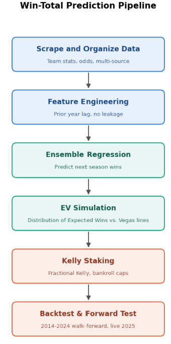
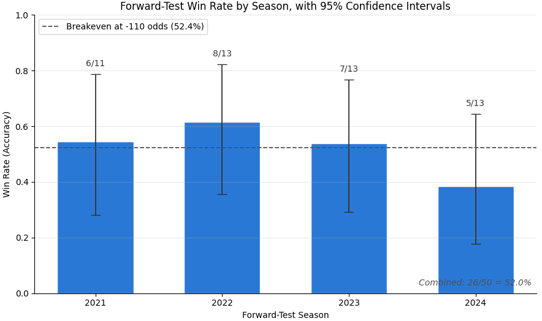
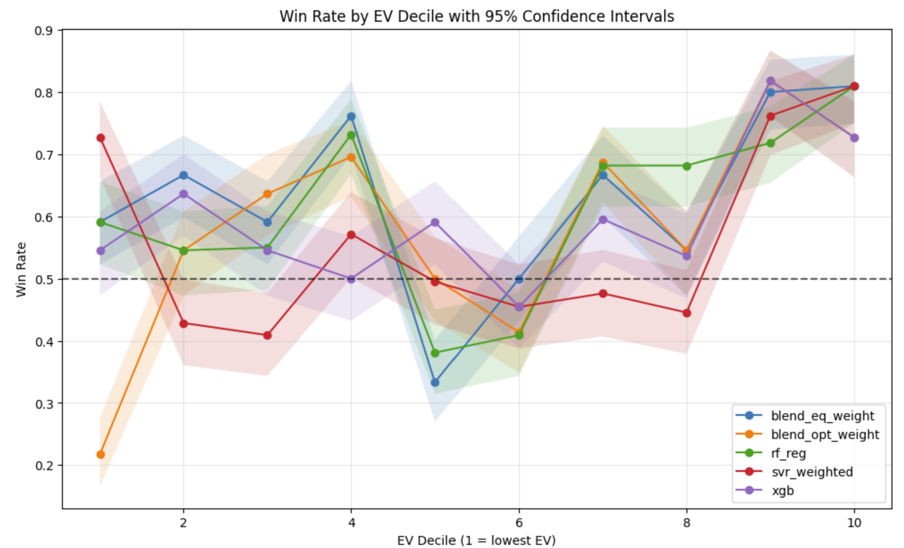

# NFL_Win_Totals_Non_Proprietary
The high level overview of how my prediction model works - the methodology, approach, and results, while keeping my exact code private. 

## Summary

A machine learning pipeline that predicts each NFL team's next-season win total from prior-season performance data, then compares that prediction against Vegas' season win-total line (e.g. "Over/Under 8.5 wins") to identify betting edges.

## Why this project

I have a statistics background and wanted a project that combined that training with real-world data. Sports betting, by design, has well thought out betting lines made by people with strong incentive to get it right. Beating it even modestly is meaningful, not just a side project or an accuracy exercise on a dataset. And if it ends up being good enough to make me some money, even better. 

## Approach

**1. Data collection**
Team-level season stats (wins/losses, point differential, strength of schedule, yards per play, turnovers, penalty yards, etc.) scraped from multiple public sources, merged into a single per-team, per-season dataset alongside historical sportsbook win-total lines and odds.

**2. Feature engineering**
Every feature used to predict a season is drawn from *prior* seasons only — no same-season stats are used as inputs. I wanted data that would be available prior to the start of the next season, and using same season data (like point differential, which is strongly correlated with wins) would leak the outcome into the prediction vs actually forecasting it.

**3. Modeling**
I used an ensemble of models (linear/ridge/lasso regression, polynomial variants, random forest, gradient boosting, XGBoost, weighted SVR) each predict next-season win totals. Predictions are combined via a weighted blend, with weights optimized against historical accuracy.

**4. Distribution of Expected Wins vs. Vegas Line**
Now it gets tricky. I didn't want to just bet on a single value - a model can say '9.2 wins', but is it 9.2 wins across what distribution? Plus or minus 3 wins? To handle this uncertainty, I first used a plain Binomial model (treating the predicted win probability as known with certainty) to handle the uncertainty. But I found this would understate that uncertainty because the predictions (the 9.2) aren't perfect, thus making the resulting edge look better than it actually is. 

Instead, each prediction is converted into a full probability distribution using a Beta Binomial model: a team's per-game win probability is itself drawn from a Beta distribution (reflecting the model's own prediction uncertainty), then a season is simulated as a Binomial draw given that probability. And of course repeated over 10,000 Monte Carlo runs. This produces a realistic, appropriately wide distribution over possible win totals, which is what allows a real EV calculation against the sportsbook line and odds, rather than just "predicted > line."

**5. Staking**
Bets are sized using a fractional Kelly criterion, proportional to edge size, capped to limit variance, rather than flat betting.

**6. Validation**
- **Walk-forward backtest**, 2014–2024: train on season N, predict season N+1, repeated across the full range.
- **Live forward test**: 2024 season data used to predict 2025 win totals, checked against actual 2025 results so I could have a true out-of-sample test with no opportunity for hindsight tuning.

## Results

- **Backtest (2014–2024, walk-forward):** best-validated model/threshold combination achieved **53.6% accuracy** against the line, averaging ~13 qualifying bets per season.
- **Live forward test (last 4 seasons):** **52% (26/50)** picking against the line — season-by-season: 6/11, 8/13, 7/13, 5/13.
- **Context:** standard -110 odds require **52.4%** accuracy to break even before any bookmaker fees. The backtest shows a modest edge above that line; the live forward test landed almost exactly on it. Four seasons is a small sample, so enough to see the model isn't broken, but not enough to claim a durable edge.

The clearest signal shows up when bets are bucketed by model-predicted EV decile: the highest EV decile (decile 10) shows a consistent win rate lift across all five models tested (73–81%), clearly above breakeven. Lower and middle deciles are noisier, mostly overlapping the 50% line within their confidence intervals, which is consistent with smaller sample sizes per decile. The model is more reliably useful for its highest-conviction bets than as a uniformly graded scale across all predictions, which is why I am making fewer bets instead of betting on all 32 teams.

## What I'd improve next
- **Pay for data**: Scraping and aggregating data across various websites is a time consuming process and limits the quality of data I can have. For a more expansive version of this project, purchasing data would allow me to focus my efforts on the modeling and methodology, not the data cleaning and aggregation.
- **Sample size**: This project has 10 seasons of data - which is exciting but it is year over year data, and the NFL only has 32 teams, and I am betting on less than 32. So the results here while encouraging are by no means sufficiently statistically significant. Applying a framework like this to games instead of seasons would greatly increase sample sizes. 
- **Feature engineering rigor**: Some inputs (like Vegas win totals themselves) were pulled in manually rather than scraped, which was a pragmatic tradeoff but introduces a manual step that doesn't scale and is worth automating.
- **Model selection stability**: The best-performing model combination shifts somewhat between backtest windows; worth testing whether a simpler, more stable model loses much accuracy relative to the current best, but less stable, ensemble.
- **Uncertainty calibration**: The Beta-Binomial simulation's variance parameter is currently hand-tuned; a more rigorous calibration process would make the EV estimates more trustworthy but I decided the complexity tradeoff was not worth it for the scope of this work.
- **Closing-line comparison**: The model is currently evaluated against the opening line; comparing against the closing line would show whether the edge exists before or after the market has priced in new information.

## Stack

Python, pandas, scikit-learn, XGBoost, statsmodels, seaborn/matplotlib, BeautifulSoup for data collection.
